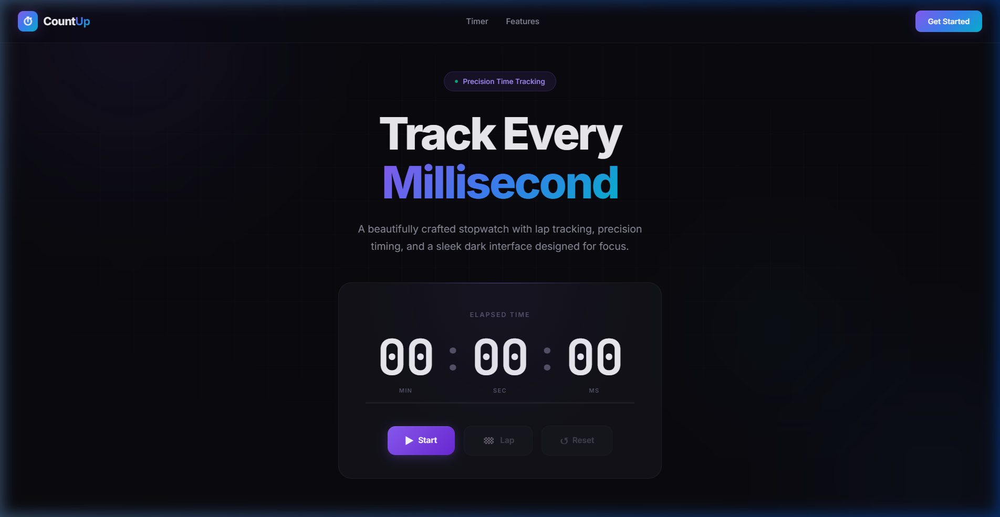

<p align="center">
  
</p>

<h1 align="center">⏱ CountUp</h1>

<p align="center">
  <b>A sleek, modern stopwatch app with a premium dark interface.</b>
</p>

<p align="center">
  
  
  
  
</p>

---

## ✨ Features

| Feature | Description |
|---------|-------------|
| ⚡ **10ms Precision** | Ultra-accurate timing with 10-millisecond intervals |
| 🏁 **Lap Tracking** | Record unlimited laps with split times and differences |
| 🎨 **Dark Theme** | Premium dark UI with glassmorphism and gradient accents |
| 🌀 **Animated Background** | Floating gradient orbs and grid overlay |
| 📱 **Responsive** | Looks great on desktop, tablet, and mobile |
| ⌨️ **Smooth Animations** | Micro-interactions and transitions throughout |

---

## 🚀 Getting Started

### Prerequisites

- [Node.js](https://nodejs.org/) (v18 or higher)
- npm or yarn

### Installation

```bash
# Clone the repository
git clone https://github.com/Ahmadzuainat/CountUp_React.git

# Navigate to the project
cd CountUp_React/counter

# Install dependencies
npm install

# Start the dev server
npm run dev
```

The app will be running at `http://localhost:5173`

---

## 🛠️ Tech Stack

- **React 19** — UI library
- **Vite 8** — Build tool & dev server
- **Tailwind CSS 4** — Utility-first CSS
- **Custom CSS** — Glassmorphism, animations, and gradients

---

## 📁 Project Structure

```
counter/
├── index.html          # Entry HTML
├── vite.config.js      # Vite configuration
├── package.json        # Dependencies & scripts
├── preview.png         # App preview screenshot
└── src/
    ├── main.jsx        # React entry point
    ├── App.jsx         # Main stopwatch component
    ├── App.css         # Component styles
    └── index.css       # Global styles & design system
```

---

## 🎯 How to Use

1. **Start** — Click the Start button to begin counting
2. **Pause** — Click Pause to freeze the timer
3. **Lap** — Record a lap while the timer is running
4. **Resume** — Click Resume to continue from where you paused
5. **Reset** — Clear the timer and all recorded laps

---

## 📸 Preview

The app features a stunning dark landing page with:
- 🔮 Animated floating gradient orbs
- 🪟 Glassmorphism timer card
- ✨ Glowing purple accent colors
- 📊 Real-time progress bar
- 🏁 Scrollable lap times list

---

## 📄 License

This project is open source and available under the [MIT License](LICENSE).

---

<p align="center">
  Crafted with 💜 precision
</p>
